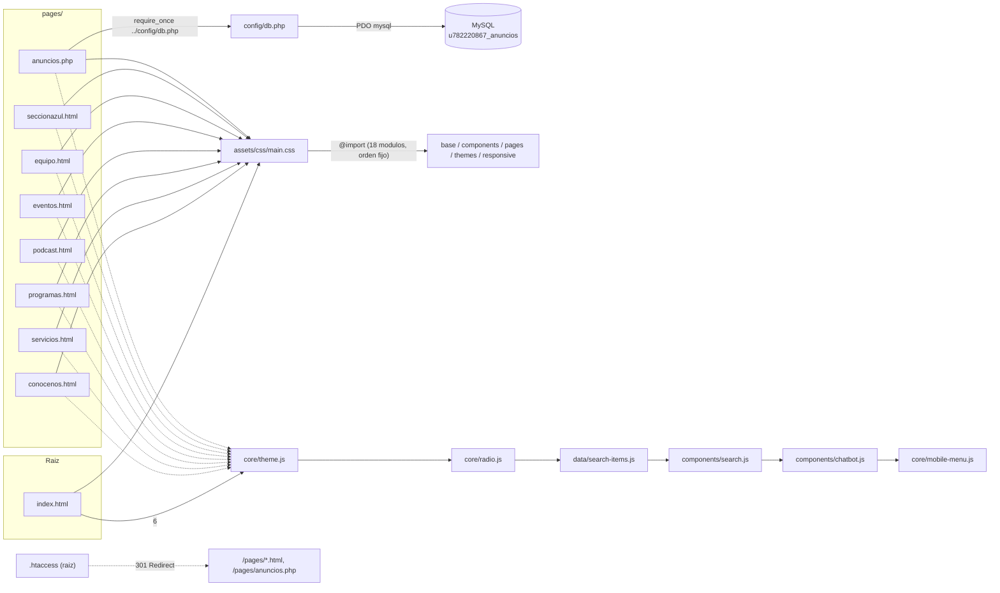

# Esquema estructural — Radio Doliv (sitio web)

Analisis de arquitectura del proyecto tras el refactor del 30 de julio de 2026. Complementa a [DOCUMENTACION_PROYECTO.md](DOCUMENTACION_PROYECTO.md), que explica el detalle funcion por funcion; este documento se enfoca en la estructura general, dependencias y riesgos.

## 1. Tipo de proyecto

Sitio web estatico multipagina (HTML + CSS + JS con modulos ES nativos), sin build system, sin framework, sin gestor de paquetes (no hay `package.json`). Una sola pagina dinamica (`pages/anuncios.php`) que consulta MySQL via PDO. Pensado para hosting compartido tipo Hostinger con Apache. Las rutas internas (paginas, CSS, JS, imagenes, audio) son absolutas desde la raiz del dominio (`/assets/...`, `/pages/...`), por lo que el sitio debe servirse desde la raiz del dominio (no desde una subcarpeta).

## 2. Arbol de archivos

```
RADIODOLIV_PAGINA/
├── index.html                    Home: hero, radio en vivo, stats, programas destacados (unica pagina en la raiz)
├── .htaccess                     Redirige URLs viejas de la raiz (/servicios.html, etc.) hacia /pages/
│
├── pages/
│   ├── conocenos.html            Institucional: mision/vision/valores
│   ├── servicios.html            10 servicios comerciales -> WhatsApp
│   ├── programas.html            Parrilla de programas activos
│   ├── podcast.html              Biblioteca de podcasts + filtros
│   ├── eventos.html              Boletaje de eventos + baja automatica por fecha
│   ├── equipo.html               Tarjetas de locutores/equipo
│   ├── seccionazul.html          Directorio de patrocinadores/aliados
│   └── anuncios.php              Unica pagina dinamica: PHP + PDO + HTML + JS
│
├── assets/
│   ├── css/
│   │   ├── core.css              Entrypoint: @import de todo lo compartido, en orden fijo
│   │   ├── responsive.css        Solo breakpoints huerfanos/compartidos (ver seccion 2a)
│   │   ├── base/
│   │   │   ├── variables.css     Tokens (color, espaciado, tipografia, radios, z-index, movimiento)
│   │   │   ├── reset.css         Reset basico + fondo global + accesibilidad (sr-only, skip-link, focus)
│   │   │   └── animations.css    [data-reveal] + .scroll-fade-*, .pulse-dot
│   │   ├── components/
│   │   │   ├── cards.css, layout.css, modals.css, buttons.css   Patrones reutilizables aditivos
│   │   │   ├── navbar-bar.css, navbar-search.css, navbar-theme-mobile.css
│   │   │   ├── chatbot.css, footer.css, sticky-player.css, carousel.css
│   │   │   └── page-transitions.css, interactions.css
│   │   ├── pages/
│   │   │   ├── conocenos.css, anuncios.css, podcast.css         (≤500 lineas, un solo archivo)
│   │   │   ├── servicios-hero.css, servicios-cards.css
│   │   │   ├── programas-hero.css, programas-list.css, programas-modal.css
│   │   │   ├── equipo-hero.css, equipo-roster.css, equipo-modal.css
│   │   │   ├── seccionazul-hero.css, seccionazul-grid.css, seccionazul-dossier.css
│   │   │   ├── eventos-base.css, eventos-hero.css, eventos-cartelera.css, eventos-modal.css
│   │   │   └── index-fresh-hero.css, index-fresh-content.css, index-fresh-footer.css
│   │   └── themes/
│   │       └── light.css         Modo claro: solo variables + overrides compartidos por 2+ paginas
│   │
│   ├── js/
│   │   ├── core/
│   │   │   ├── theme.js          Tema claro/oscuro
│   │   │   ├── radio.js          Reproductor de radio persistente + reconexion
│   │   │   └── mobile-menu.js    Menu hamburguesa movil
│   │   ├── components/
│   │   │   ├── search.js         Buscador global (Ctrl+K)
│   │   │   └── chatbot.js        DoliBot
│   │   └── data/
│   │       └── search-items.js   Datos del buscador global (searchItems)
│   │
│   ├── img/
│   │   ├── logo/, locutores/, patrocinadores/, programas/, portadas/, eventos/, anuncios/, servicios/
│   └── audio/
│       └── podcasts/             4 archivos MP3 (~90-120MB c/u)
│
├── config/
│   ├── db.php                    Credenciales + conexion PDO a MySQL (usado por pages/anuncios.php)
│   └── .htaccess                 Bloquea acceso HTTP directo a config/
│
├── DOCUMENTACION_PROYECTO.md
└── ESQUEMA_PROYECTO.md
```

`stilo.css`, `script.js`, `styles-v2.css` y `anuncios.html` (los archivos monoliticos y el redirect legacy previos al refactor) ya no existen: su contenido vive repartido en `assets/css/`, `assets/js/` y `pages/anuncios.php` respectivamente.

## 2a. Arquitectura CSS (reorganizacion 2026-08-13)

Antes de esta reorganizacion, `assets/css/` tenia 20 archivos (~9.750 lineas): `base.css` mezclaba variables + reset + animaciones en un solo archivo de 259 lineas; `themes/light.css` (560 lineas) y `responsive.css` (452 lineas) mezclaban overrides compartidos con overrides especificos de cada pagina en un solo archivo cada uno; y 8 archivos (paginas + `navbar.css`) superaban las 500 lineas, el mas grande con 1.565. Esto se reorganizo en 4 fases, todas sin cambiar ningun valor/selector/comportamiento visual (verificado con diff linea por linea contra un respaldo pre-reorganizacion y con pruebas manuales en navegador para cada fase):

1. **Capa compartida**: `base.css` se dividio en `base/variables.css`, `base/reset.css`, `base/animations.css`. `components/patterns.css` se redistribuyo en `components/cards.css`, `layout.css`, `modals.css`, `buttons.css` (su `.pulse-dot` paso a `base/animations.css`). `core.css` sigue siendo el unico `@import` manifest, solo que ahora apunta a estos archivos mas chicos.
2. **De-mezcla de `light.css`/`responsive.css`**: cada bloque de esos dos archivos que pertenecia a una sola pagina o componente se movio al final del archivo dueño de esa clase, bajo un comentario `/* Light theme */` o `/* Mobile */`. Lo que quedo en `themes/light.css`/`responsive.css` es solo lo compartido por 2+ paginas mas un puñado de selectores legacy que ya no coinciden con ningun HTML actual (documentados como tal en el propio archivo, no borrados por seguridad).
3. **Division de archivos grandes**: los 8 archivos que superaban 500 lineas se dividieron en 2-3 archivos por pagina/componente, siguiendo sus propias secciones internas (por ejemplo `eventos.css` → `eventos-hero.css` + `eventos-tickets.css` + `eventos-modal.css`; `eventos-tickets.css` se renombro despues a `eventos-cartelera.css`, ver seccion 2b). `inc/partials/head.php` ya soportaba `$pageStylesheet` como array (un `<link data-page-css>` por entrada), asi que cada `pages/*.php` afectado solo cambio su `$pageStylesheet` de un string a un array; el router AJAX (`page-router.js`) no necesito ningun cambio, ya que compara cada `<link>` por su `href` resuelto sin parsear el contenido del CSS.
4. **Deduplicacion**: solo se extrajeron bloques *byte-identicos* (por ejemplo 4 paginas que copiaban a mano el literal `130px 5% 90px` en vez de usar el token `--page-shell-padding` que ya existia para eso). Los patrones *parecidos pero no identicos* (blur/glass/badges con valores distintos por pagina) se dejaron como estan: forzarlos a ser iguales habria sido un cambio de diseño, no una reorganizacion.

Convenciones nuevas:
- Un archivo de pagina/componente **no se divide** si tiene ≤500 lineas.
- Cada archivo dividido lleva un comentario de cabecera explicando de que parte del original viene y a cual sigue.
- Los overrides de tema claro y de mobile de cada pagina/componente viven al **final de su propio archivo**, no en un archivo central — mas facil de encontrar, mismo resultado visual (el tema claro ya ganaba por especificidad de selector, no por orden de carga, asi que moverlos no cambio cual regla gana).

## 2b. Rediseno de Eventos (2026-08-18)

`pages/eventos.php` era un calco del template comercial "Nautica" pegado dentro del sitio: cargaba su propio par de fuentes (Lora + Montserrat, una peticion extra a Google Fonts que bloquea el render) y definia un sistema completo de tokens `--nx-*` que duplicaba, con otros valores, la paleta que `base/variables.css` ya define. Se rehizo en dos pasadas; lo que quedo es la segunda.

**Primera pasada** (bandas de color + rejilla de tarjetas) se descarto: resolvia los problemas de arquitectura pero el resultado se leia generico, porque metia cada evento en una caja con borde, radio y sombra. Eso contradice el criterio que el resto del sitio ya sigue — el CSS de Conocenos lo dice con todas sus letras: *"texto puro, sin tarjetas: columnas separadas por una linea fina en vez de una caja con fondo/borde, para que el reveal de scroll se sienta en el texto mismo y no en un contenedor"*.

**Version actual.** Toma de `pages/conocenos.php` las cuatro decisiones que definen su lenguaje:

1. **Capitulos de 100vh**, uno por idea (portada / escenario / cartelera / cierre), centrados sobre el fondo continuo del sitio — sin bandas de color propias.
2. **Titulares enormes** (hasta 8vw, peso 800) como protagonistas, con el tramo acentuado en degradado (`.ev-gradient`, mismo gesto que `.text-gradient` de Conocenos).
3. **Cero cajas.** El separador es siempre una linea fina. La cartelera dejo de ser una rejilla de tarjetas y es un **indice editorial**: numero de orden, titulo grande, fecha/lugar, cuenta regresiva y enlace de boletos en una fila, con el cartel apareciendo en un **visor que sigue al cursor** (`.ev-peek`). En pantallas sin hover cada fila lleva su miniatura. La cuenta regresiva del escenario tambien es tipografia, no un widget de celdas.
4. **Capa ambiental animada** detras del contenido, creada y destruida por JS sin HTML nuevo en el PHP, igual que Conocenos hace con su globo de Vanta. Aqui **no** es el globo: son focos de luz difusos tenidos con los colores dominantes del cartel que se este mirando (se muestrean del `` con un canvas de 12x12 y se mezclan al 50 % con la paleta de marca, para que el evento tina la luz sin sacarla de la identidad). Se dibuja en un lienzo de ~240px de ancho estirado por CSS al viewport: el propio escalado hace de desenfoque, sin WebGL ni filtro `blur`.

Otros cambios de fondo, independientes del aspecto:

- **Capa de datos**: `event_countdown()` y `get_events_for_display()` viven en `inc/data/events.php`. Antes la cuenta regresiva era una funcion declarada dentro de `pages/eventos.php` de la que dependia el componente de tarjeta, asi que ese componente solo funcionaba si lo incluia esa pagina; y el indice de cada evento se resolvia con `array_search($event, $events, true)` dentro de bucles anidados — O(n²) y por VALOR, de modo que dos eventos con los mismos campos habrian abierto siempre el modal del primero.
- **Componente**: `inc/components/card-event.php` se reemplazo por `inc/components/event-row.php`, con su contrato documentado en la cabecera.
- **Contenido duplicado**: el diseno heredado repetia los mismos eventos en tres secciones seguidas ("Proximos eventos", "Destacados" y "Cartelera completa"); con la cartelera real (2 eventos activos) la pagina mostraba el mismo cartel seis veces.
- **Proporcion de los carteles**: son cuadrados (1080x1080) y se recortaban en un banner de 2.34:1 y en marcos 4:5. Ahora se muestran cuadrados y completos.
- **Archivos CSS**: cuatro (`eventos-base` + `eventos-hero` + `eventos-cartelera` + `eventos-modal`), todos por debajo del limite de ~500 lineas de la convencion, y cada uno con sus reglas de mobile y de tema claro al final de su propio archivo.
- **Aparicion por scroll**: el bloque `IntersectionObserver` que estaba copiado en cuatro `pages/*.js` es ahora `RadioDoliv.utils.observeReveal()` en `core/utils.js`, con opcion `once:false` para el gesto reversible que usan las paginas de capitulos. Eventos ya lo usa; las demas se pueden migrar despues (la utilidad es aditiva).
- **Tokens y modal**: los alias `--ev-*` se declaran en `.ev-main` **y** en `.ev-modal`. El modal no es descendiente de `<main>` (el router lo trata como `[data-page-content]` y lo cuelga de `<body>`), asi que sin eso `var(--ev-accent)` no resolvia ahi dentro y el enlace de compra salia sin color.

## 3. Diagrama de dependencias



## 4. Capas del sitio

| Capa | Archivo(s) | Responsabilidad |
|---|---|---|
| Presentación | `index.html`, `pages/*.html`, `pages/anuncios.php`, `assets/css/**` | Maquetado y estilos de cada sección |
| Comportamiento global | `assets/js/core/`, `assets/js/components/` (6 scripts clasicos cargados en orden) | Tema claro/oscuro, radio en vivo, menú móvil, buscador global, chatbot DoliBot |
| Datos estáticos en JS | `assets/js/data/search-items.js` + arreglos embebidos por pagina (`teamMembers`, `blueSponsors`, `radioDolivEvents`) | Contenido editable directo, sin backend |
| Datos dinámicos | `pages/anuncios.php` + `config/db.php` | Único punto que lee de una base de datos real (MySQL) |
| Recursos | `assets/img/**`, `assets/audio/**` | Servidos estáticamente, referenciados por ruta absoluta desde la raíz |
| Compatibilidad de URLs | `.htaccess` (raíz) | Redirige rutas antiguas de la raíz hacia `/pages/` (301) |

## 5. Rutas relativas + `window.SITE_BASE`

Primera version de este refactor uso rutas absolutas (`/assets/...`, `/pages/...`). Se revirtio porque al abrir `index.html` con doble clic (protocolo `file://`, sin servidor), el navegador resuelve `/assets/...` contra la raiz del disco (`C:/assets/...`) en vez de la raiz del proyecto, y ademas bloquea los `<script type="module">` entre archivos locales por CORS. Por eso ahora:

- Todas las rutas de `<link>`, `<script src>`, `` y `<a href>` en el HTML son **relativas a la profundidad de cada pagina**: `index.html` usa `assets/...`, `pages/...`; las paginas dentro de `pages/` usan `../assets/...` y nombres de archivo sueltos entre si (por ejemplo `servicios.html` desde `pages/equipo.html`).
- El JavaScript ya no usa modulos ES (`type="module"`, `import`/`export`); cada pagina carga 6 `<script>` clasicos en orden (`core/theme.js`, `core/radio.js`, `data/search-items.js`, `components/search.js`, `components/chatbot.js`, `core/mobile-menu.js`), que comparten el mismo scope global como lo hacia el `script.js` original.
- Como `data/search-items.js` y `components/chatbot.js` son los mismos archivos cargados tanto desde `index.html` como desde `pages/*.html`, sus datos guardan las rutas de pagina **sin barra inicial y relativas a la raiz del sitio** (`pages/servicios.html`, `index.html`). Cada pagina define `window.SITE_BASE` antes de cargar los scripts (`""` en `index.html`, `"../"` en `pages/*`), y esos dos modulos anteponen `window.SITE_BASE` al construir cada enlace o `src` de imagen.
- Esto funciona igual abriendo el archivo directo (`file://`), con un servidor estatico simple, o en Hostinger — sin depender de que el sitio se sirva desde la raiz del dominio.

## 6. Compatibilidad de URLs (redirects)

Mover páginas de la raíz a `/pages/` cambia sus URLs públicas. Para no romper enlaces ya compartidos (QR de eventos, publicaciones en redes, posicionamiento SEO), el `.htaccess` de la raíz define redirecciones 301 desde cada ruta vieja hacia su nueva ubicación, por ejemplo `/servicios.html → /pages/servicios.html`. Esto depende de Apache/mod_rewrite (como en Hostinger); un servidor estático simple (usado solo para pruebas locales) lo ignora.

## 7. Patron de "cache busting"

`assets/css/main.css` y cada uno de los 6 `<script>` de `assets/js/` se cargan con el mismo query param de versión (`?v=20260730refactor`) para forzar a Hostinger/navegador a descartar cache vieja tras el refactor. Los módulos CSS internos (`assets/css/components/*.css`, etc.) no llevan versión propia porque se cargan vía `@import` desde `main.css` — basta con cambiar la versión de `main.css` para invalidar todo el árbol CSS. Los 6 archivos JS sí se referencian cada uno directamente desde el HTML (no hay un solo entrypoint desde que se quitaron los módulos ES), así que un cambio de versión debe actualizarse en las 6 etiquetas `<script>` de cada página. **No hay build tool**: el versionado sigue siendo manual.

## 8. Fuente de datos por sección (para saber donde editar)

| Seccion | Fuente de datos | Sincroniza tambien con |
|---|---|---|
| Programas destacados | HTML fijo en `index.html` y `pages/programas.html` | `searchItems` en `assets/js/data/search-items.js` |
| Servicios | HTML fijo en `pages/servicios.html` (10 tarjetas) | `getDolivServicesReply()` en `assets/js/components/chatbot.js` |
| Podcast | tarjetas HTML en `pages/podcast.html` + `.mp3` en `assets/audio/podcasts/` | `searchItems` |
| Anuncios | tabla MySQL vía `pages/anuncios.php` | ninguna (no pasa por `searchItems`) |
| Eventos | tabla MySQL `radio_events` via `inc/data/events.php` (`event_date` para autobaja) | `searchItems` |
| Equipo | array `teamMembers` en `pages/equipo.html` | `searchItems` |
| Sección Azul | array `blueSponsors` en `pages/seccionazul.html` | `searchItems` (si aplica) |

Esto significa que el sitio tiene **7 fuentes de verdad distintas** para contenido (una por sección) más el buscador global que debe mantenerse manualmente en paralelo — no hay una sola fuente central de datos. Esto no cambió con el refactor de carpetas; sigue siendo la principal deuda técnica de contenido.

## 9. Radio en vivo (pieza más compleja del JS)

`STREAM_URL = "https://stream.zeno.fm/vrfurwfubkhtv"` en `assets/js/core/radio.js`. Se maneja con `localStorage` (`radioPlaying`, `radioVolume`, `radioUserPaused`) porque el audio no persiste entre cargas de página distintas (no es SPA). Reconexión controlada con backoff (15s en `waiting/stalled`, 5s en `error/ended`, hasta 30s máx). Este módulo se copió tal cual desde el antiguo `script.js` sin tocar su lógica interna, precisamente para no arriesgar esta parte ya delicada del sitio. Detalle completo de la evolución histórica de esta lógica está documentado en `DOCUMENTACION_PROYECTO.md` sección "Correcciones recientes".

## 10. Riesgos / deuda tecnica detectados

1. **Credenciales en texto plano en el repo**: [config/db.php](config/db.php) contiene usuario y contraseña reales de MySQL en claro. `.htaccess` bloquea el acceso HTTP directo (correcto en Apache/Hostinger), pero el archivo sigue siendo legible por cualquiera con acceso al repositorio/filesystem. Si este proyecto se sube a un repositorio git compartido, las credenciales quedarían expuestas en el historial.
2. **Sin gestor de dependencias ni build**: el versionado de cache (`?v=...`) sigue siendo manual.
3. **Duplicación de datos**: 7 arreglos de contenido distintos + `searchItems` deben mantenerse sincronizados a mano.
4. **Audios pesados** (87-118 MB cada uno) servidos directamente sin CDN/streaming.
5. **Dependencia de mod_rewrite/Apache para las redirecciones 301**: si el hosting cambiara a un servidor sin soporte de `.htaccess`, las URLs viejas dejarían de redirigir (aunque seguirían funcionando las nuevas).
6. ~~Imagen rota preexistente (`cronologiadigital.jpeg`)~~ — ya no aplica: verificado durante la reorganizacion de CSS de 2026-08-13 que ninguna hoja de estilos actual referencia esa ruta (se corrigio en algun punto entre el refactor original y ahora, sin actualizar este documento).
7. **Sin PHP/MySQL disponibles en este entorno de desarrollo**: no fue posible probar `pages/anuncios.php` end-to-end contra la base de datos real durante la verificación de este refactor; sí se verificó que su ruta a `config/db.php` quedó correctamente actualizada.

## 11. Recomendaciones rápidas

- Mover `config/db.php` a variables de entorno o al menos fuera del árbol servible, y si el proyecto se versiona con git, confirmar que no está commiteado con las credenciales reales (o rotarlas).
- Si el sitio crece, considerar centralizar los datos (por ejemplo JSON compartido) en vez de arreglos JS duplicados por página + `searchItems`.
- Probar `pages/anuncios.php` en un entorno con PHP + MySQL (o directamente en Hostinger) antes de dar el refactor por cerrado del todo, ya que aquí solo se validó estáticamente.
